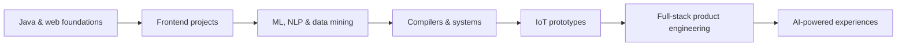

<div align="center">


# Hey there 👋 I'm Toufique Ahamed

### Full-stack developer · AI/ML explorer · Compiler & systems enthusiast

<p>
  I build useful software across the stack — from polished web experiences and learning platforms
  to IoT prototypes, machine-learning experiments, and compilers.
</p>

<p>
  <a href="https://github.com/tofa19?tab=repositories"></a>
  <a href="https://www.linkedin.com/in/toufique-ahamed-71402a312"></a>
  <a href="mailto:tofa.dev19@gmail.com"></a>
</p>


</div>

<p align="center">
  <a href="#-about-me">About</a> ·
  <a href="#-what-im-building-now">Now</a> ·
  <a href="#-toolbox">Toolbox</a> ·
  <a href="#-selected-work">Projects</a> ·
  <a href="#-github-dashboard">Dashboard</a> ·
  <a href="#-lets-connect">Connect</a>
</p>

---

## 🧑‍💻 About me

```text
I’m a CSE student who learns by building — then rebuilding things better.

Focus       → Full-stack development, AI/ML, NLP, compiler design, embedded systems
Mindset     → Curious, practical, open-source friendly
Currently   → Turning real product ideas into reliable, end-to-end software
Fun fact    → I build, break, debug, and rebuild. That is my favourite feedback loop.
```

## 🚀 What I'm building now

<table>
  <tr>
    <td width="50%" valign="top">
      <h3>🎓 SkillStream</h3>
      <p>A production-shaped course platform with storefront, student learning, instructor, admin, B2B organization, and sales-agent experiences.</p>
      <p>
        
        
        
        
      </p>
      <a href="https://github.com/grsdevgroup-luminar/gls-learning">View the platform →</a>
    </td>
    <td width="50%" valign="top">
      <h3>🧠 Learning in public</h3>
      <p>Going deeper into AI, NLP, ethical AI, data mining, compiler design, and the systems that make software dependable.</p>
      <p><b>Next experiments:</b> better developer tooling, thoughtful automation, and more useful ML-powered products.</p>
    </td>
  </tr>
</table>

## 🧰 Toolbox

<p align="center">
  
</p>

<details>
<summary><b>How I use these tools</b></summary>
<br />

| Area | Tools I reach for |
| --- | --- |
| Product engineering | Next.js, React, TypeScript, Tailwind CSS, JavaScript |
| Backend & data | NestJS, PostgreSQL, Prisma, Redis, REST APIs |
| AI & research | Python, Jupyter, data mining, NLP, machine learning |
| Systems & hardware | C, C++, Arduino, IoT prototypes, compiler design |
| Workflow | Git, GitHub, Docker, VS Code |

</details>

## ✨ Selected work

<table>
  <tr>
    <td width="50%" valign="top">
      <h3>🌦️ WeatherNow</h3>
      <p>A JavaScript weather project and one of my most recent public builds.</p>
      <a href="https://github.com/tofa19/WeatherNow">Open repository →</a>
    </td>
    <td width="50%" valign="top">
      <h3>🪪 idgo-frontend</h3>
      <p>A modern JavaScript frontend experiment focused on building a clean product interface.</p>
      <a href="https://github.com/tofa19/idgo-frontend">Open repository →</a>
    </td>
  </tr>
  <tr>
    <td width="50%" valign="top">
      <h3>🅿️ Smart Parking IoT</h3>
      <p>An embedded-systems project exploring connected parking and real-world automation.</p>
      <a href="https://github.com/tofa19/smart_Parking_IoT">Open repository →</a>
    </td>
    <td width="50%" valign="top">
      <h3>🤖 DMML Project</h3>
      <p>Data Mining & Machine Learning lab work documented in Jupyter Notebook.</p>
      <a href="https://github.com/tofa19/DMML-Project">Open repository →</a>
    </td>
  </tr>
  <tr>
    <td width="50%" valign="top">
      <h3>⚖️ Ethical AI</h3>
      <p>Exploring responsible AI ideas for recruitment systems and decision-making.</p>
      <a href="https://github.com/tofa19/ethical-ai">Open repository →</a>
    </td>
    <td width="50%" valign="top">
      <h3>🔖 MiniLang Compiler</h3>
      <p>A compiler-design project that turns language fundamentals into working code.</p>
      <a href="https://github.com/tofa19/miniCompiler">Open repository →</a>
    </td>
  </tr>
</table>

<p align="center">
  <a href="https://github.com/tofa19?tab=repositories"></a>
</p>

<details>
<summary><b>More projects from the journey</b></summary>
<br />

- ♚ [Capture the King](https://github.com/tofa19/Python_game) — Python strategy board game
- 🧾 [Matrimonial Bio Generator](https://github.com/tofa19/Biodata-form) — HTML-based form project
- 🧮 [Calculator](https://github.com/tofa19/Calculator) — JavaScript fundamentals project
- 💪 [FitFusion Gym](https://github.com/tofa19/FitFusion-Gym) — interactive JavaScript web experience
- 🏥 [Hospital Management System](https://github.com/tofa19/Hospital-Management-System) — web application project
- 🚚 [Courier Service](https://github.com/tofa19/Courier-Service) — an early Java project

</details>

## 🗺️ Project journey



## 📊 GitHub dashboard

<div align="center">
  
  
</div>

<div align="center">
  
</div>

<div align="center">
  
</div>

## 🤝 Let's connect

<p>
  Have an interesting idea, a thoughtful issue, or a project where software can help? I’d love to hear about it.
</p>

<p align="center">
  <a href="https://www.linkedin.com/in/toufique-ahamed-71402a312"></a>
  <a href="mailto:tofa.dev19@gmail.com"></a>
  <a href="https://github.com/tofa19"></a>
</p>

<div align="center">

### Thanks for stopping by ✨


<sub>Built with curiosity, caffeine, and a lot of git commits.</sub>

</div>
